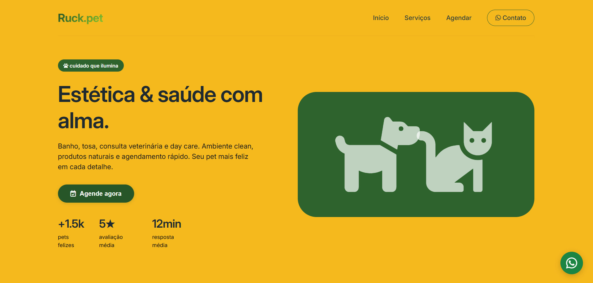

# 🐾 Ruck Pet – Landing Page Moderna para Petshop


**Ruck Pet** é uma landing page moderna, minimalista e responsiva para um petshop. O projeto foi desenvolvido com foco em **engajamento** e **agendamentos**, utilizando HTML semântico, CSS Grid, Flexbox e JavaScript para manipulação do DOM e armazenamento local.

🔗 **Demonstração online:** [clique aqui]https://mrlonaragao.github.io/projeto-final/)

---
## 📋 Funcionalidades

- ✅ **Design minimalista e clean** – cores suaves, tipografia moderna e espaçamento generoso.
- ✅ **Totalmente responsivo** – adapta-se a desktop, tablet e mobile.
- ✅ **Formulário de agendamento** – com validação de campos e abertura direta no WhatsApp.
- ✅ **Armazenamento local (localStorage)** – os agendamentos ficam salvos no navegador para consulta futura.
- ✅ **Botão flutuante do WhatsApp** – para contato imediato e aumento de conversão.
- ✅ **Seções bem estruturadas** – Hero, Serviços, Diferenciais, Depoimentos, Rodapé.
- ✅ **Animações suaves** – hover nos cards e efeito de entrada ao carregar.
- ✅ **Scroll suave** – navegação interna leva até o formulário de agendamento.

---

## 🛠️ Tecnologias Utilizadas

| Tecnologia | Descrição |
|------------|-------------|
| **HTML5** | Estrutura semântica (header, main, section, article) |
| **CSS3** | Grid, Flexbox, variáveis, transições, responsividade |
| **JavaScript (ES6+)** | DOM manipulation, eventos, localStorage, validação de formulário |
| **Font Awesome 6** | Ícones vetoriais modernos |
| **Google Fonts** | Família Inter (clean e legível) |

---

## 📁 Estrutura do Projeto

├── index.html # Página principal (HTML + CSS + JS inline)
├── README.md # Documentação do projeto
└── assets/ # (opcional) imagens, ícones, etc.

---

## 🚀 Como executar localmente

1. **Clone o repositório**
   ```bash
   git clone https://github.com/MrlonAragao/projeto-final
Acesse a pasta

bash
cd lume-pet
Abra o arquivo index.html no seu navegador

Duplo clique no arquivo ou use uma extensão como "Live Server" no VS Code.

Pronto! O site estará rodando localmente.

🌐 Implantação no GitHub Pages
Faça o push do projeto para um repositório público no GitHub.

Vá em Settings > Pages.

Em "Branch", selecione main e a pasta / (root).

Clique em Save.

Aguarde alguns minutos e acesse https://github.com/MrlonAragao/projeto-final

🎯 Como funciona o sistema de agendamento
O usuário preenche o formulário com nome, nome do pet, WhatsApp, data, horário e serviço.

Ao clicar em Confirmar agendamento, o JavaScript:

Valida se todos os campos estão preenchidos.

Salva os dados no localStorage do navegador.

Exibe uma mensagem de sucesso.

Redireciona para o WhatsApp com uma mensagem pré-formatada contendo todos os detalhes.

A equipe do petshop recebe a mensagem e pode confirmar o horário.

🔁 O localStorage mantém um histórico de todos os agendamentos feitos no dispositivo. Para visualizá-los: abra o DevTools > Application > Local Storage.

📱 Personalização para seu negócio
Para usar esta landing page no seu próprio petshop, altere:

Número do WhatsApp – Substitua 5547999999999 por seu número real (com código do país, sem espaços).

Texto de exemplo – Ajuste as mensagens enviadas pelo WhatsApp.

Horários e serviços – Edite os <option> no formulário e nos cards de serviços.

Cores – Modifique as variáveis CSS (principalmente #2C5F2D e #97BC62).

Logo e nome – Troque "lume.pet" pelo nome do seu negócio.

🧪 Possíveis Melhorias Futuras
Adicionar backend com Node.js ou Firebase para salvar agendamentos em nuvem.

Envio automático de e-mail de confirmação.

Calendário interativo para escolha de horários disponíveis.

Página de obrigado após agendamento.

Modo escuro (dark mode).

🤝 Contribuição
Contribuições são bem-vindas! Siga os passos:

Faça um fork do projeto.

Crie uma branch para sua feature (git checkout -b feature/nova-feature).

Commit suas alterações (git commit -m 'Adiciona nova feature').

Push para a branch (git push origin feature/nova-feature).

Abra um Pull Request.

📄 Licença
Este projeto está sob a licença MIT. Sinta-se livre para usar, modificar e distribuir.

✨ Autor
Desenvolvido por Seu Nome – apaixonado por código e pets ❤️🐕


Gostou do projeto? Deixe uma ⭐ no repositório!


Agora é só copiar esse texto, criar um arquivo `README.md` na raiz do seu projeto e colar o conteúdo. Não esqueça de substituir os placeholders como `seu-usuario`, o link do GitHub Pages e adicionar uma imagem de screenshot se desejar.
